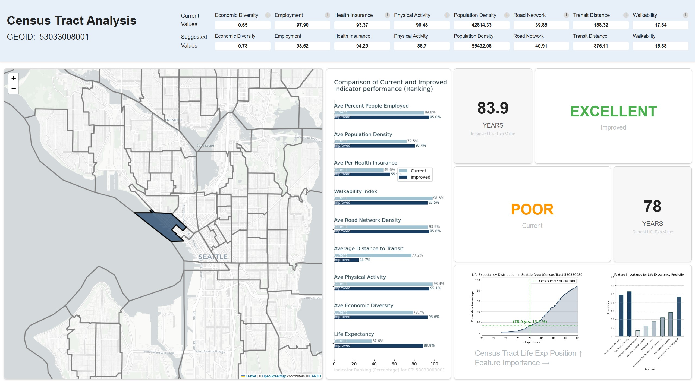

# CSE583 - Urban Health Analysis

Urban health index analysis is a visualization tool for policy makers at urban and community scale. This is a first phase tool development for a urban health research, jointly developpped as CSE583 course Project. This visualization tool focuses on various metropoliton regions across the United States. 

# Project Members & Contributions

- Eva - Project idea conception, and project lead. Developed front end code, and machine learning model 
- Aishwarya - Backend code and map development as well as front end integration
- Sam - Documentation and UI design development and front end web design
- Jingheng - Documentation and city analysis functions and city/census tract integration 

# Docs:

- Project Design Doc: SystemDesign.md (to transform from DocumentationDraft.docx)
  · Idea and Background
  · User Story and Use Cases
  · Componennt Design
  · Tech review (to add tables for pros and cons)
  · Schedule of development (milestones)
  · Chanllenges and Highlights (tech and management)
- Tech review (presentation):
- Tech implementation (Core details)

# Project Structure:

Backend:\
|--- App.py is the main function\
|--- function_ct.py is the census tract level functions\
|--- data_preprocessing is the city level functions\

Fontend: urban-health-consultant-v0-frontend\
|--- src: \
|----|---- App.js shows the routings (../public/index.html and index.js shows the root created for the react app)\
|----|---- utils.js contains the data getting and posting functions for the frontend to or from the backend\
|----|---- Under the components folder --> The three pages (landing page, city level annalysis, census tract level analysis) each

# To run the app:

- run the backend first using: flask --app backend/app run
- Note that you'll need to have all packages installed to run successfully (install flask, etc)
- run the frontend:
- first change to the frontent directory: cd urban-health-consultant-v0-frontend
- (If it the first time you run the frontend, you should use "npm install" here)
- then use: npm start
- The frontend should run succesfully

# If successful:
A given city and census tract level analysis by features such as (transit, commute, insurance coverage, etc.) should look like the following. 

# Other Info: 

We decided to temporarily ignore the Pylint style check since we use several languages in the app.
